# Weather App

simple weather app built with react and some pwa features

-   [x] works offline or has a customize offline instead of default browser offline scree
-   [x] can be installed on all devices i.e andriod, ios, mac...
-   [x] uses a simple cahcing technique
-   [x] service worker
-   [x] web app manifest
-   [x] splash screen when runing as standalone app
-   [x] apple, web, fav icons

## demo

There is the demo link to the app [https://main-weather.netlify.app/](https://main-weather.netlify.app/)

### landing page

So, this is just a simple page with a search input, just enter any city and see the weather info

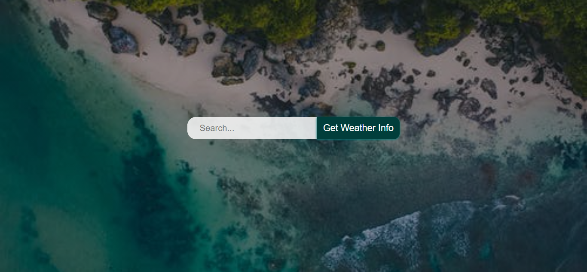

### loading data

the spinner here shows as long data is still fetching and has not been resolved

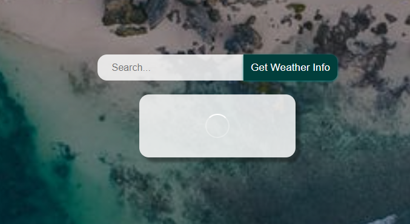

### finish loading data

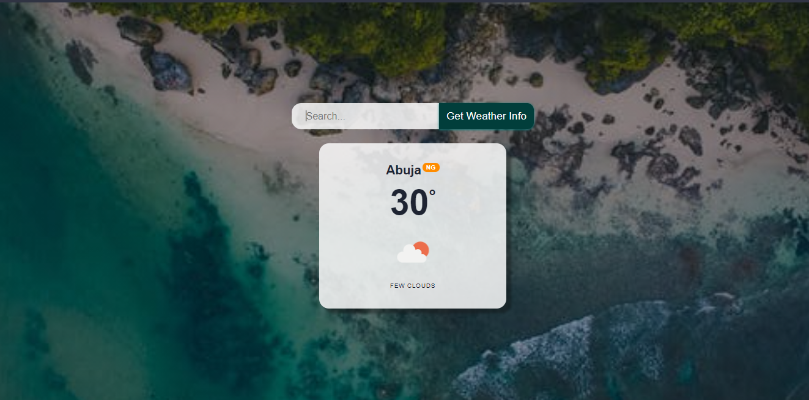

### fetching error or 404

This is incase your enter city cannot be found
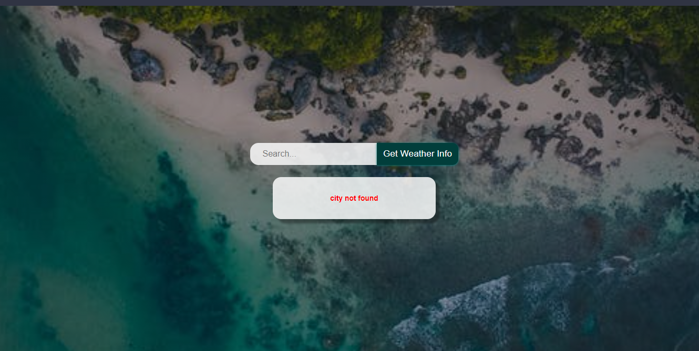

## demo on mobile

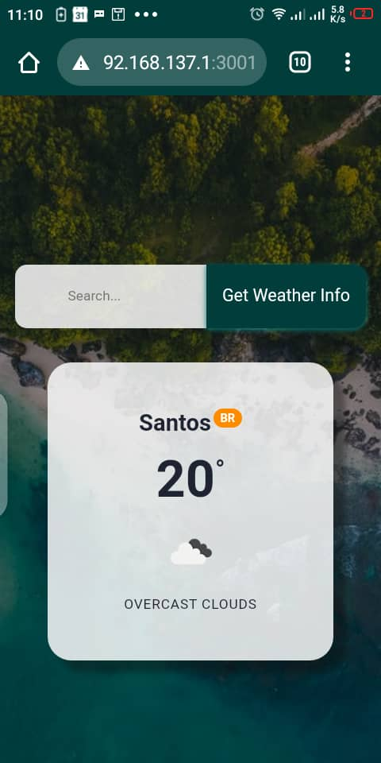

## installing the web app

You can simply install the webpage on any device, it does not take time or data like installing an app form play store, just like a second and I don't think it requires data as long the webpage has been loaded

### If you are on a Pc installing is as simple as

-   Go to the top right side of your browser search bar

    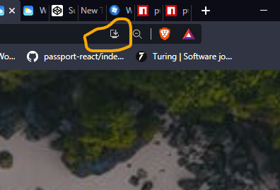

-   Click on the icon that looks like a download or install icon(varies depend on OS and browser)
-   Click install on the install prompt and you are done, app will now appear on your home screen

    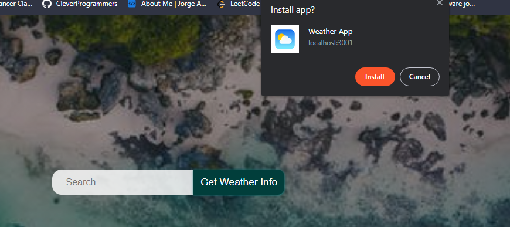

### installing on mobile is as simply as am using chrome on mobile but the steps should not any different in other browser. And by way, installing would work on light weight browsers like opera mini

-   On the right top part of your browser click on the three dots to open a menu

    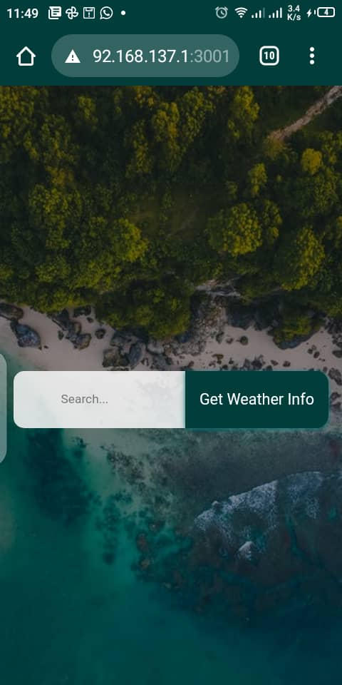

-   Then scroll down a little on the menu and click on add to home screen

    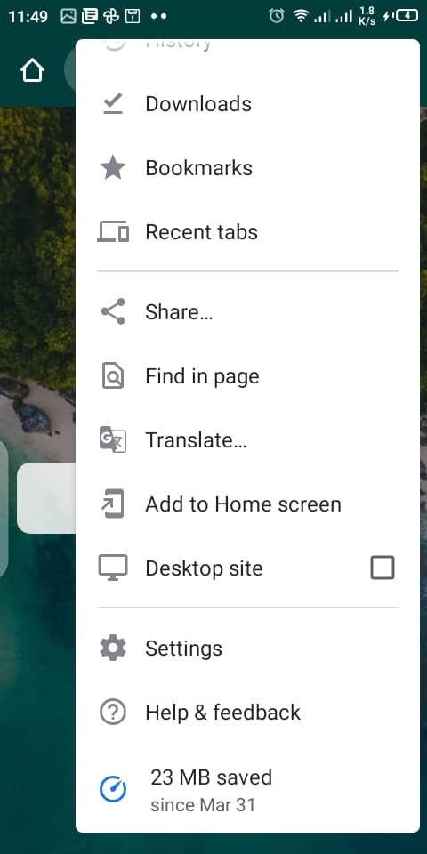

-   Now you will see a prompt, give it any name you what or just leave the default

    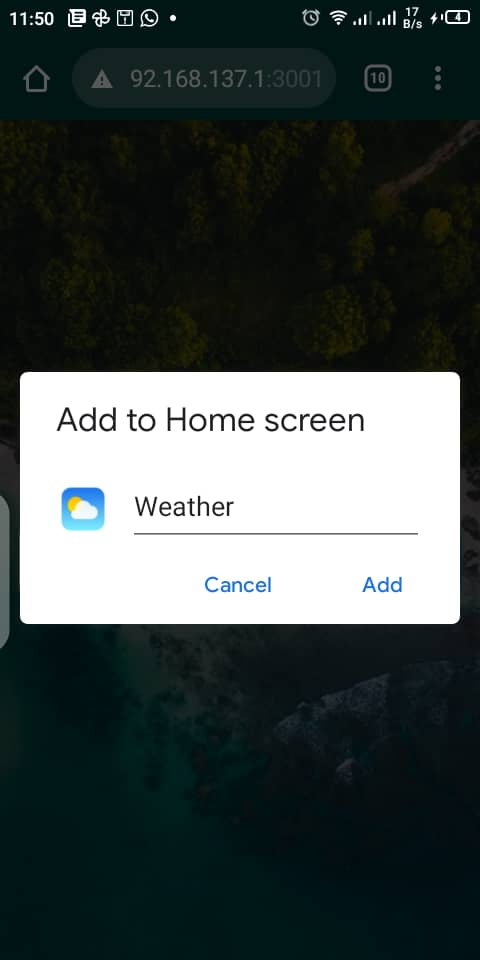

-   Now you will see another prompt click on add

    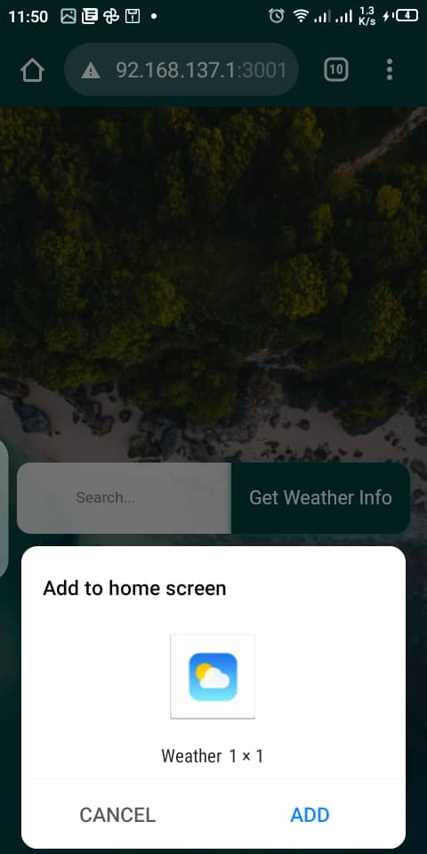

-   Go to home screen and see the added app

    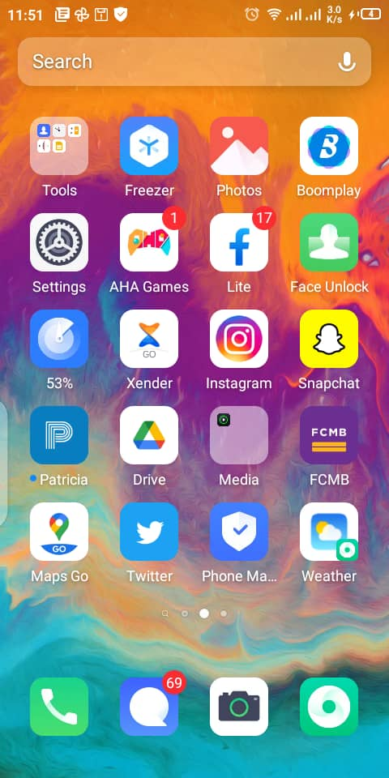

-   Now click and open just like any other app

    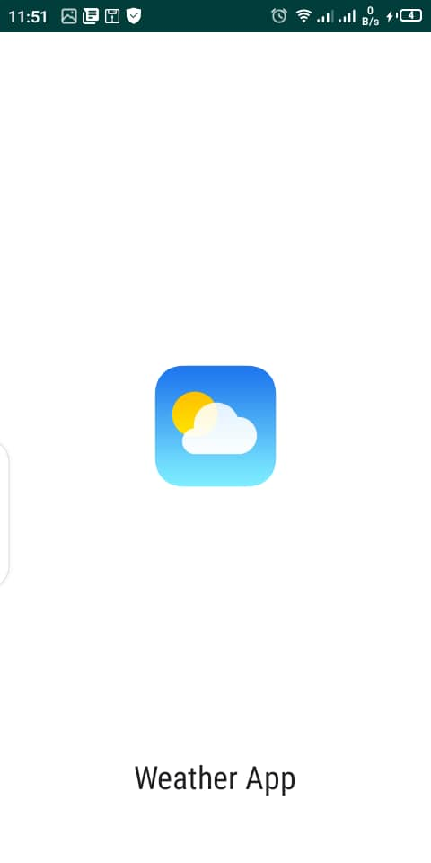

-   Now site is runing standalone

    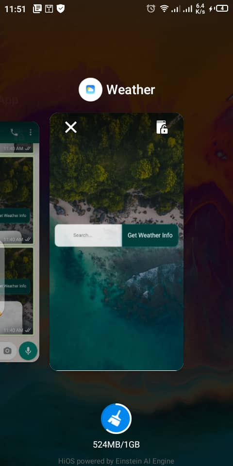
